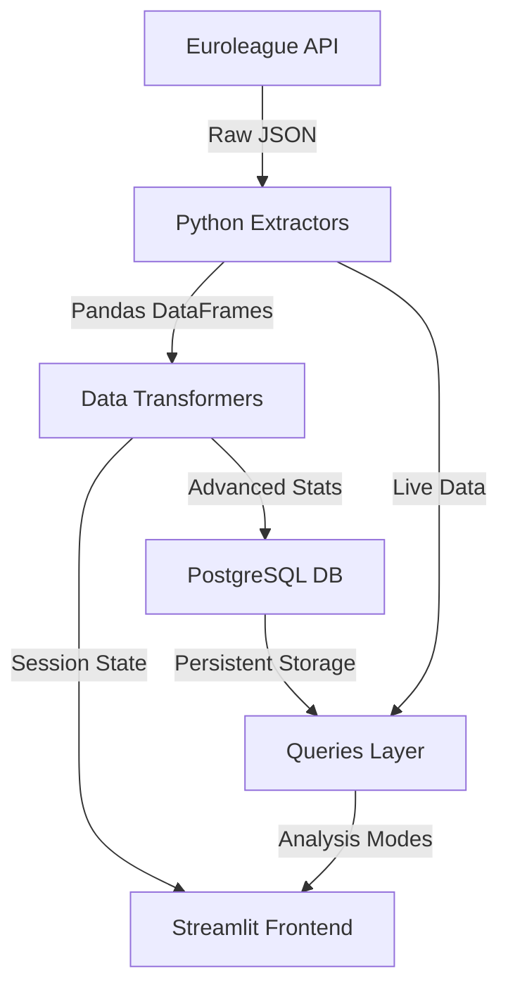

# Euroleague Advanced Analytics Platform: System Architecture & Data Flows

This document provides a comprehensive overview of the system architecture, data pipelines, and user interface navigation for the Euroleague Advanced Analytics Platform.

---

## 1. High-Level System Architecture

The platform is designed as a modular analytics engine that bridges real-time Euroleague data with advanced statistical modeling and interactive visualization.

### Data Flow Components:
*   **Euroleague API**: The source of truth for Boxscores, Play-by-Play (PBP), and Shot coordinates.
*   **Extractors (`extractors.py`)**: Responsible for API communication, data normalization, and team/player alias mapping.
*   **Transformers (`transformers.py`)**: The "Brain" of the platform. Computes 13+ advanced metrics, reconstructs lineups, and links cross-domain data (e.g., matching PBP assists to Shot coordinates).
*   **PostgreSQL Database**: Persistent storage for historical analysis and sub-second dashboard loading (containerized via Docker).
*   **Streamlit Frontend (`app.py`)**: Multi-page interactive dashboard with reactive internationalization (i18n).

---

## 2. Data Pipeline Flows (ETL)

The platform utilizes three primary specialized pipelines to transform raw API events into actionable insights.

### 🏀 Play-by-Play Pipeline
Tracks the "flow" of the game beyond individual boxscore stats.
*   **Lineup Tracking**: Reconstructs the exact 5-man combinations on the floor by parsing "IN" and "OUT" substitution events.
*   **Assist Network**: Identifies Passer → Scorer relationships by linking `AS` events to the preceding made shot (`2FGM`/`3FGM`).
*   **Momentum Analysis**: Detects scoring runs (8+ unanswered points) and identifies the "Run Stopper" (the opponent player who broke the run).

### 📊 Boxscore Pipeline
Standardizes raw data into possession-independent efficiency metrics.
*   **Situational Scoring**: Aggregates points from Fastbreaks, Turnovers, and Second Chances.
*   **Positional Stats**: Automatically classifies players into **Guard**, **Forward**, or **Center** based on their Assist-to-Rebound ratios before calculating positional point distributions.
*   **Efficiency Metrics**: Computes True Shooting % (TS%), Offensive/Defensive Ratings, and True Usage Rate.

### 🔮 Predictive Pipeline
Uses statistical modeling to project scoring expectations and game outcomes.
*   **Expected Points (xP)**: Calculates the point value of every shot attempt based on Euclidean distance from the hoop and historical zone accuracy (FIBA standard).
*   **Win Probability**: (In Development) Analyzes score differential and remaining time to estimate real-time game outcome likelihood.

---

## 3. UI Navigation Map (The Dashboard Flow)

The dashboard is structured around a cascading selection logic that allows users to drill down from league-wide trends to individual player actions.

### 🛠 Sidebar Logic
1.  **Analysis Mode**: Select between *Single Game*, *Season Overview*, *Referee Analytics*, or *Metrics Glossary*.
2.  **Cascading Dropdowns**: 
    *   **Season** (e.g., 2024-25) ➡️ **Round** (e.g., Round 12) ➡️ **Game** (e.g., OLY vs PAO).
    *   In Season Mode: **Season** ➡️ **Team Selection**.

### 📱 View Hierarchies

#### **Single Game Analysis**
*   **🏅 Player Stats**: Sortable table featuring custom metrics (tUSG%, Stop Rate, Net Rating).
*   **🎯 Shot Chart**: Half-court Plotly visualization showing makes, misses, and shot quality.
*   **📡 Comparison Radar**: 5-axis normalized comparison between any two players in the game.
*   **👥 Lineup & Synergy**: Performance tables for 5-man units, Duos, and Trios.
*   **🔗 Assist Network**: Heatmap of passing relationships and "lethal pairs."
*   **🪄 Playmaking**: Breakdown of **AAQ** (creators) and **AxP** (finishers).
*   **🔥 Clutch & Momentum**: Visualization of high-pressure performance and run stoppers.

#### **Season Overview**
*   **League efficiency landscape**: ORtg vs DRtg scatter plot of all 18 teams.
*   **Pace vs Efficiency**: Identification of team "DNA" (Fast/Efficient, Slow/Inefficient, etc.).
*   **Home vs Away Splits**: Analysis of home-court advantage impact on Net Rating.
*   **Clutch DNA**: Scatter plots linking average point differential to **Clutch Win %**.

#### **Referee Analytics**
*   Detailed Win/Loss record for the selected team under specific officiating crews.

---

## 4. Metric Glossary & Locations

| Metric | Definition | Tab / View |
| :--- | :--- | :--- |
| **AAQ** | **Adjusted Assist Quality**: The mean Expected Points (xP) of shots created by a player. | Playmaking Analysis |
| **AxP** | **Assisted xPoints**: The total expected value a finisher extracts from teammates' passes. | Playmaking Analysis |
| **Net Rating** | Team point differential per 100 possessions when a player/lineup is on court. | Lineups / Player Stats |
| **True Usage (tUSG%)** | % of team plays "used" by a player, including shots, turnovers, and fouls drawn. | Player Stats / Season Overview |
| **Stop Rate** | Percentage of defensive possessions a player actively ends via STL, BLK, or REB. | Player Stats |
| **Clutch Win %** | Win percentage in "Close Games" (score difference ≤ 5 in last 5 minutes). | Season Overview / Clutch |
| **TS%** | **True Shooting**: Holistic efficiency weighing 3s, 2s, and Free Throws equally. | Player Stats |
